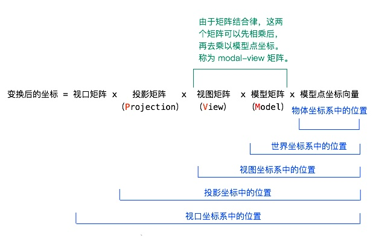

- - -
### 关于渲染的相关基础学习
本节内容来自 [卡通渲染（上）：致从没看懂过着色器代码的你](https://zhuanlan.zhihu.com/p/25595069)
#### 关于如何进行光照计算
在明白了这点之后，我们就能够理解如何进行光照计算了。
1. 将光源位置（这是通过参数传入的）乘以模型视图矩阵（这是着色器提供给我们的），就能得到光源相对于摄像机的位置
2. 将这一位置归一化（就是计算单位向量），得到光源相对于摄像机的角度
3. 将其点乘单位法向量，得到亮度值（回想一下，两个向量点乘的意思是，获得一个向量在另一个向量上的投影，所以，这里得到的是光源在法向量方向的投影长度，它决定了一个点有多亮）

#### MVP矩阵

其中，中间的三项有个非常霸气的名字：MVP 矩阵！
为什么不是 PVM ？
因为从逻辑上来说，是先把模型点坐标向量乘以模型矩阵，然后乘以视图矩阵，然后乘以投影矩阵，然后乘以视口矩阵的。所以先后顺序的确是 MVP。
我们知道矩阵乘法是一个很耗时的操作，而由于模型矩阵和视图矩阵更可能是不变的，因而根据矩阵结合律，将它们先相乘得到模型视图矩阵（modal-view matrix），再与点坐标相乘。这样，以后几帧的计算，就可以不用分别乘以模型矩阵和视图矩阵，而是只乘以模型视图矩阵，达到减少矩阵乘法的次数的效果。
这一点稍作了解即可，如果看不懂，你只需要了解——
**一个物体的三维坐标向量，乘以模型视图矩阵后，能够得到它在试图坐标系中的位置，也就是它相对于摄像机的坐标位置。**
- - -
### 关于模型空间的小记
在Unity中，我们可以通过调整Transform组件中的Position属性来改变模型的位置，这里的位置指的是相对于这个Transform的父节点(parent)的模型坐标空间中的原点定义的。
如果一个Transform没有任何父节点，那么这个位置就是在世界坐标系中的位置

- - -
### 关于Pass的理解
**介于目前还未深入学习图形学，现在所学习的内容均基于《UnityShader入门精要》与网络**

[渲染中的pass是什么意思（知乎）？](https://www.zhihu.com/question/40306111)
来源：知乎
就是一次像素处理和一次顶点处理
也就是一次绘制。
有些渲染需要多次绘制有的一次绘制即可。
比如说模糊，可以垂直一个pass加水平一个pass 来处理，
也可以合并到一个pass处理，但如果是sm2，受到限制可能必须拆开成为两个pass才能做

[一夜九卷的cxc的回答](https://www.zhihu.com/question/305707508/answer/596008426)
来源：知乎
相似问题：计算机图形里面的RenderingPass（渲染通道）我这样理解对吗？
1.一个渲染通道就是走完一个图形底层的渲染流程（VS->TS->GS->光栅化->PS）吗？
    对，一个rendering pass就是完整的走一遍渲染管线，每一个pass最终都得到一帧数据，放在绑定的帧缓存中（可以是off-screen方式，也可以直接渲染到系统帧缓存）,一个帧缓存对象可以挂载深度缓存，颜色缓存，模板缓存。后续的pass可以通过纹理采样的方式来获取前驱pass得到的颜色、深度或者模板信息。
    2.然后多个渲染通道混合在一起最后组成一帧呈现到屏幕上？我这样理解对吗？
    可以说对，也可以说不对。要看你怎么定义这个混合操作，一般来说multiple passes都是为了实现一个rendering pass做不到的效果，或者更高效的方式。比如shadowing就是要先渲染depth map，再渲染场景，一遍pass是肯定不行的，因为你没有得到整个场景的depth信息，那你能不能说depth信息和场景信息混合起来就得到了带shadow的场景呢？ 也可以，因为lighting pass确实利用了depth信息。简单来说，多rendering pass中的每一个pass都是相互依赖的，后面的pass一般来说用到了前面pass得到的数据，比如深度信息啊，几何信息啊这些，最后一个pass得到最终的帧缓存，相当于是多道“工序”这么个意思，每个pass都是一道工序。
    断水流宗师: 2 个月前一个例子就是『图层』的概念，一直保留上一个子过程的结果。
    一夜九卷的cxc (作者) 回复断水流宗师2 个月前不同图层之间的像素是叠加 融混操作来得到最终像素颜色，而不同rendering pass之间不一定会有这种像素颜色的叠加，有可能只是利用某个pass的结果来辅助后续pass作一些判断，比如丢弃片源(early-z)