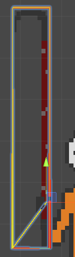

获取四点+中心位置

* * *

今天需要**计算一个collider的四个顶点位置**以及**通过collider内置变量获取sprite中心点位置**

```
cCenter = _boxCollider2D.bounds.center;
wr = _boxCollider2D.bounds.size.x/2;
hr = _boxCollider2D.bounds.size.y/2;
line.changePosition(0, new Vector3(cCenter.x - wr, cCenter.y - hr, 0f));
line.changePosition(1, new Vector3(cCenter.x + wr, cCenter.y - hr, 0f));
line.changePosition(2, new Vector3(cCenter.x + wr, cCenter.y + hr, 0f));
line.changePosition(3, new Vector3(cCenter.x - wr, cCenter.y + hr, 0f));
line.changePosition(4, new Vector3(cCenter.x - wr, cCenter.y - hr, 0f));
```

可以使用bounds来确定中心点+四个点的位置

* * *

```
line.changePosition(5, new Vector3(cCenter.x - _boxCollider2D.offset.x, cCenter.y - _boxCollider2D.offset.y, 0f));
```

可以使用offset来确定中心点位置