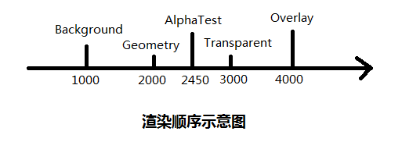

from [瞎聊 Unity Shader 系列之七：究竟谁先被渲染？](http://blog.shuiguzi.com/2015/05/06/Shader_7/ )

> Tags { “Queue” = “XXXX” }

上面的 `XXXX` 是 Queue 标签的值，这个值在内部是整数型的索引。**数值越小，越先被渲染**。但是不要以为直接填整数就可以，Shaderlab 不支持直接填数值，而是先定义好了 5 个具有描述性的词来代替单调的数值。他们是：

*   **Background：** 对应数值为 1000，用于需要被最先渲染的对象，如背景什么的
*   **Geometry：** 对应数值为 2000, 用于不透明的物体。这个是默认的选项（如果不指明 Queue 标签的值，自动给你指定为 Geometry）
*   **AlphaTest：** 对应的数值为 2450, 用于需要使用 AlphaTest 的对象来提高性能AlphaTest 类似于裁剪 (clip) 功能
*   **Transparent：** 对应的数值为 3000， 用于需要使用 alpha blending 的对象，比如粒子，玻璃等
*   **Overlay：** 对应的数值为 4000，用于最后被渲染的对象，比如 UI

