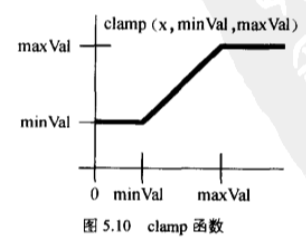
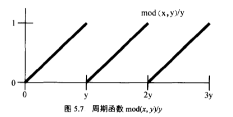

*   [WebGL心形效果](https://blog.51cto.com/vaero/972083?source=drt)
*   [【OpenGL】Shader实例分析（二）－ Heart](https://www.cnblogs.com/cooka/p/3673819.html)
*   [C++中反正切atan2(y,x)与atan(x)](https://blog.csdn.net/chen825919148/article/details/7582510)
*   [Shader smoothstep使用](https://blog.csdn.net/u010333737/article/details/82859246)

* * *

### 心形绘制

> **atan(x, y)** - y/x的反正切，其返回值为\[-pi, +pi\]之间的一个数

**atan(x, y):** 在[三角函数](http://zh.wikipedia.org/wiki/%E4%B8%89%E8%A7%92%E5%87%BD%E6%95%B0)中，两个参数的[函数](http://zh.wikipedia.org/wiki/%E5%87%BD%E6%95%B0)，atan是[正切函数](http://zh.wikipedia.org/wiki/%E6%AD%A3%E5%88%87%E5%87%BD%E6%95%B0)的一个变种。对于任意不同时等于0的实参数x和y，**atan(y,x)所表达的意思是坐标原点为起点，指向(y,x)的射线在坐标平面上与x轴正方向之间的角的角度度**。当y>0时，射线与x轴正方向的所得的角的角度指的是x轴正方向绕逆时针方向到达射线旋转的角的角度；而当y<0时，射线与x轴正方向所得的角的角度指的是x轴正方向绕顺时针方向达到射线旋转的角的角度。

* * *

> **smoothstep(a, b, x)** - 可以用来生成0到1的平滑过渡

返回值

条件

0

x < a < b 或 x > a > b

1

x < b < a 或 x > b > a

某个值

根据x在域 \[a, b\] (或者\[b, a\])中的位置, 返回某个在 \[0, 1\] 内的值

float smoothstep(float a, float b, float x)
{
    float t = saturate((x - a)/(b - a));
    return t\*t\*(3.0 - (2.0\*t));
}
// saturate(x)的作用是如果x取值小于0，则返回值为0。
// 如果x取值大于1，则返回值为1。若x在0到1之间，则直接返回x的值

* * *

> **clamp(T x, float minValue, float mzxValue)** \- 返回的value介于A、B之间，若value小于min，返回min，若大于max，返回max

clamp函数

* * *

> **mod(T x, T y)** - 取模，可以看作是取余数

函数 mod(x, y)/y 的图像

* * *

> **mix(T x, T y, T a)** - **返回 _x \* (1.0 - a) + y \* a_** 结果就是 lerp 插值操作。

* * *

 Three框架      body { margin: 0px; } div#canvas-frame { border: none; cursor: pointer; width: 100%; height: 600px; background-color: #EEEEEE; }   uniform float time; varying vec2 vUv; uniform float testSize; void main( void ) { vec2 position = testSize + 2.0 \* vUv; float red = abs( sin( position.x \* position.y + time / 5.0 ) ); float green = abs( sin( position.x \* position.y + time / 4.0 ) ); float blue = abs( sin( position.x \* position.y + time / 3.0 ) ); gl\_FragColor = vec4( red, green, blue, 1.0 ); }   varying vec2 vUv; varying vec3 ps; void main() { vUv = uv; ps = position; vec4 mvPosition = modelViewMatrix \* vec4( position, 1.0 ); gl\_Position = projectionMatrix \* mvPosition; }   uniform float time; varying vec2 vUv; varying vec3 ps; uniform float testSize; // 跳动速度 float speed = 8.0; void main( void ) { vec2 p = 0.02 \* ps.xy; p.y -= 0.3; //background color vec3 bcol = vec3(1.0, 0.8, 0.7 - 0.07 \* p.y) \* (1.0 - 0.25 \* length(p)); // animate float tt = mod(time, speed) / speed; float ss = pow(tt,.2) \* 0.5 + 0.5; ss -= ss \* 0.2 \* sin(tt \* 6.2831 \* 3.0) \* exp(-tt \* 4.0); p \*= vec2(0.5, 1.5) + ss \* vec2(0.5, -0.5); // shape float a = atan(p.x, p.y)/3.141593; float r = length(p); float h = abs(a); float d = (13.0\*h - 22.0\*h\*h + 10.0\*h\*h\*h)/(6.0-5.0\*h); // color float s = 1.0 - 0.5 \* clamp(r/d, 0.0, 1.0); s = 0.75 + 0.75 \* p.x; s \*= 1.0 - 0.25 \* r; s = 0.5 + 0.6 \* s; s \*= 0.5 + 0.5 \* pow( 1.0 - clamp(r/d, 0.0, 1.0 ), 0.1 ); vec3 hcol = vec3(1.0,0.5 \* r,0.3) \* s; vec3 col = mix( bcol, hcol, smoothstep( -0.01, 0.01, d-r) ); gl\_FragColor = vec4(col, 1.0 ); }  var renderer; var clock; var uniforms1, zhuantouUniforms; var camera, mouseControls, guiControls; var scene; var light; var mesh, zhuantou; //几何物体 function initObject() { uniforms1 = { time: { value: 1.0 }, testSize: { value: -1.0 }, color: {value: new THREE.Vector3(0.2, 0.2, 0.2)} }; var params = uniforms1; // var geometry = new THREE.CylinderGeometry(100, 150, 400); var geometry = new THREE.CubeGeometry(100, 100, 1, 100); var material = new THREE.ShaderMaterial({ uniforms: params, vertexShader: document.getElementById('vertex\_shader').textContent, fragmentShader: document.getElementById('heart\_fragment\_shader').textContent }); mesh = new THREE.Mesh(geometry, material); // mesh.position = new THREE.Vector3(-100, 0, 0); mesh.position.set(0, 0, 0); scene.add(mesh); } // 初始化调试工具 function initControl() { // 调用gui调试台 guiControls = new function() { this.testSize = -1.0; } // var gui = new dat.GUI(); // gui.add(guiControls, 'testSize', -2, 2); // 辅助线 // var axes = new THREE.AxisHelper(500); // scene.add(axes); } function controlUpdate() { var delta = clock.getDelta(); uniforms1.time.value += delta \* 5; uniforms1.testSize.value = guiControls.testSize; } //初始化webgl function initThree() { width = document.getElementById('canvas-frame').clientWidth; height = document.getElementById('canvas-frame').clientHeight; renderer = new THREE.WebGLRenderer({ antialias: true }); renderer.setSize(width, height); document.getElementById('canvas-frame').appendChild(renderer.domElement); renderer.setClearColor(0xFFFFFF, 1.0); clock = new THREE.Clock(); } //设置相机 function initCamera() { camera = new THREE.PerspectiveCamera(45, width / height, 1, 10000); camera.position.set(0, 0, 180); camera.up = new THREE.Vector3(0,1,0); camera.lookAt(0,0,0); } //初始化场景 function initScene() { mouseControls = new THREE.OrbitControls(camera, renderer.domElement); scene = new THREE.Scene(); } //设置化灯光 function initLight() { light = new THREE.AmbientLight(0xFF0000); light.position.set(100, 100, 200); scene.add(light); } //运行webgl function threeStart() { initThree(); initCamera(); initScene(); initLight(); initObject(); initControl(); animation(); } //设置动态场景 function animation() { mouseControls.update(); controlUpdate(); renderer.render(scene, camera); requestAnimationFrame(animation); } 

> 最终代码

<!DOCTYPE html>
<html>
<head>
    <meta charset="UTF-8">
    <title>Three框架</title>
    
    
    
    
    

    

    
    

    
</head>

<body onload="threeStart();">
    

</body>
</html>