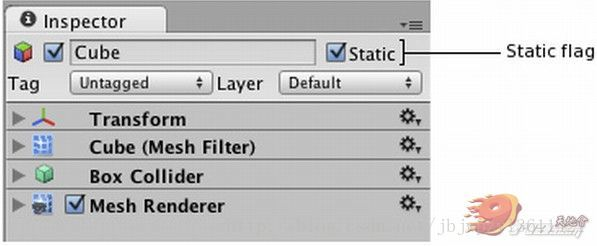

文章： [Unity\_\_静态合批与动态合批](https://blog.csdn.net/le_sam/article/details/84929740)

draw call是openGL的描绘次数（directX没怎么研究，但原理应该差不多）  
一个简单的openGL的绘图次序是：设置颜色→绘图方式→顶点座标→绘制→结束。  
每帧都会重复以上的步骤。这就是一次draw call  
  
如果有两个model，那么需要    
设置颜色→绘图方式→顶点座标A→绘制→结束。  
设置颜色→绘图方式→顶点座标B→绘制→结束。  
两次draw calls;  
也就是说在openGl绘制前，如果色彩通道(color filter)，绘图方式(shader)，顶点座标（model）不同的情况下draw calls就会增加。  
  
**对openGl来说绘制参数（状态值）的变更要比绘制大量的顶点更耗费cpu。**  
  
所谓高速绘图就是，在尽量不改变openGl状态值的情况下，用一次draw call完成所有绘制。  
比如上面的例子：  
设置颜色→绘图方式→顶点座标A＋顶点座标B→绘制→结束。  
就要更加有效率。  
  
个人估计unity3d的dynamic batch,static batch都是通过一定的方法使不同的object的顶点座标能够结合成一个整体，达到减少draw calls的效果。  
但是有一定的要求限制，比如material要相同，mesh要相同并在300个面以内等等，这些都是为了保证openGl的状态值不改变。

**Unity在 Player Setting 里的两个功能选项 Static Batching 与 Dynamic Batching。功能描述如下：**

1.  Static Batching 是将标明为 Static 的静态物件，如果在使用相同材质球的条件下，Unity 会自动帮你把这两个物件合并成一个 Batch，送往 GPU 来处理。这功能对效能上非常的有帮助，所以是需要付费才有的。
2.  Dynamic Batching 是在物件小于300面的条件下(不论物件是否为静态或动态)，在使用相同材质球下，Unity就会自动帮你合合并成一个 Batch 送往 GPU 来处理。

在屏幕上渲染物体，引擎需要发出一个绘制调用来访问图形API（iOS系统中为OpenGL ES）。每个绘制调用需要进行大量的工作来访问图形API，从而导致了CPU方面显著的性能开销。

Unity在运行时可以将一些物体进行合并，从而用一个绘制调用来渲染他们。这一操作，我们称之为“批处理”。一般来说，Unity批处理的物体越多，你就会得到越好的渲染性能。

Unity中内建的批处理机制所达到的效果要明显强于使用几何建模工具（或使用Standard Assets包中的CombineChildren脚本）的批处理效果。这是因为，Unity引擎的批处理操作是在物体的可视裁剪操作之后进行的。Unity先对每个物体进行裁剪，然后再进行批处理，这样可以使渲染的几何总量在批处理前后保持不变。但是，使用几何建模工具来拼合物体，会妨碍引擎对其进行有效的裁剪操作，从而导致引擎需要渲染更多的几何面片。

**材质**

只有拥有相同材质的物体才可以进行批处理。因此，如果你想要得到良好的批处理效果，你需要在程序中尽可能地复用材质和物体。

如果你的两个材质仅仅是纹理不同，那么你可以通过 纹理拼合 操作来将这两张纹理拼合成一张大的纹理。一旦纹理拼合在一起，你就可以使用这个单一材质来替代之前的两个材质了。

如果你需要通过脚本来访问复用材质属性，那么值得注意的是改变Renderer.material将会造成一份材质的拷贝。因此，你应该使用Renderer.sharedMaterial来保证材质的共享状态。

**动态批处理**

如果动态物体共用着相同的材质，那么Unity会自动对这些物体进行批处理。

动态批处理操作是自动完成的，并不需要你进行额外的操作。

**Tips:**

1、 批处理动态物体需要在每个顶点上进行一定的开销，所以动态批处理仅支持小于900顶点的网格物体。

2、 如果你的着色器使用顶点位置，法线和UV值三种属性，那么你只能批处理300顶点以下的物体；如果你的着色器需要使用顶点位置，法线，UV0，UV1和切向量，那你只能批处理180顶点以下的物体。

3、请注意：属性数量的限制可能会在将来进行改变。

4、 不要使用缩放尺度（scale）。分别拥有缩放尺度(1,1,1)和(2,2,2)的两个物体将不会进行批处理。

5、 统一缩放尺度的物体不会与非统一缩放尺度的物体进行批处理

使用缩放尺度(1,1,1)和 (1,2,1)的两个物体将不会进行批处理，但是使用缩放尺度(1,2,1)和(1,3,1)的两个物体将可以进行批处理。

6、 使用不同材质的实例化物体（instance）将会导致批处理失败。

7、拥有lightmap的物体含有额外（隐藏）的材质属性，比如：lightmap的偏移和缩放系数等。所以，拥有lightmap的物体将不会进行批处理（除非他们指向lightmap的同一部分）。

8、 多通道的shader会妨碍批处理操作。比如，几乎unity中所有的着色器在前向渲染中都支持多个光源，并为它们有效地开辟多个通道。

9、预设体的实例会自动地使用相同的网格模型和材质。

**静态批处理**

相对而言，静态批处理操作允许引擎对任意大小的几何物体进行批处理操作来降低绘制调用（只要这些物体不移动，并且拥有相同的材质）。因此，静态批处理比动态批处理更加有效，你应该尽量使用它，因为它需要更少的CPU开销。

为了更好地使用静态批处理，你需要明确指出哪些物体是静止的，并且在游戏中永远不会移动、旋转和缩放。想完成这一步，你只需要在检测器（Inspector）中将Static复选框打勾即可，如下图所示：

**使用静态批处理操作需要额外的内存开销来储存合并后的几何数据**。在静态批处理之前，如果一些物体共用了同样的几何数据，那么引擎会在编辑以及运行状态对每个物体创建一个几何数据的备份。这并不总是一个好的想法，因为有时候，你将不得不牺牲一点渲染性能来防止一些物体的静态批处理，从而保持较少的内存开销。比如，将浓密森里中树设为Static，会导致严重的内存开销。

**静态批处理目前只支持Unity iOS Advanced。**