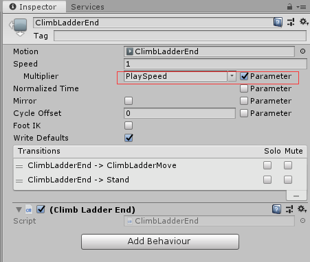
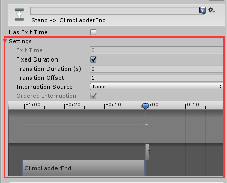

该方法需要配合Unity的Animator中的Transition来完成

在这个例子中，我是通过 继承了StateMachineBehaviour的类中的OnStateEnter方法中完成的

首先在Unity的Animator中选中目标Animation，出现如下图所示的变量，按照红框内标记的内容勾选并填入

写入后，在需要设置成为倒放的地方添加animator.SetFloat("PlaySpeed", -1);即可，这里的PlaySpeed （变量名称随便） 可以视为调节速度的参数，在原有的基础上与PlaySpeed相乘。

【重点】此处为我的个人项目中遇到的问题，可能根据此方法大多会触发这个事件。

当对应的.anim文件（也就是在文件夹中的Animation文件）的LoopTime选项为无的时候，会发生**倒放的动画卡在第一帧**，我的猜想是，当前播放的正常顺序应该是（假设Animation的播放时间为3.2）3.2 => 0，也就是从最后一帧到第一帧，我的脚本中设置播放PlaySpeed的位置为StateEnter，此时的动画已经播放到第一帧，系统识别已经到达最终目标，而且Animation没有选择Loop，所以会卡在“执行完毕”的情景下。所以根据这个猜想，应该是**在调用倒放之前，使进入该动画的位置变为最后一帧**，为了解决这个我尝试使用“在脚本中将animator强行跳到最后一帧的位置上”，但始终没有找到解决方法，最后是通过**在Unity的Animator界面中，调节相应的Transition（前一个Animation到当前Animation的那一支），调节内容如下所示**

将需要执行的动画放在前面

这样设置，就可以了~