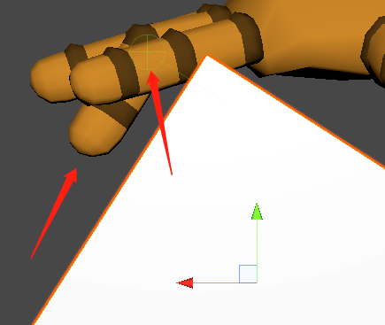

```
Transform boneTransform = _animator.GetBoneTransform(bone);
Ray ray = new Ray(boneTransform.position,  boneTransform.forward);
RaycastHit hit;
if (Physics.Raycast(ray, out hit, collisionMaxDistance)) {
    // 测试：将指节的法线方向变为hit的normal
    _animator.SetBoneLocalRotation(bone, Quaternion.LookRotation(boneTransform.InverseTransformDirection(-hit.normal)));
}
```

逻辑：

*   获取hit的normal反方向：-hit.normal
*   将hit的Normal反方向转到当前骨节的本地坐标下
*   使用四元数的LookRotation方法指向目标方向
*   将结果通过SetBoneLocalRotation的方式赋值到相应骨节上

SetBoneLocalRotation在试验后得到的结论：只能在OnAnimatorIK中使用

