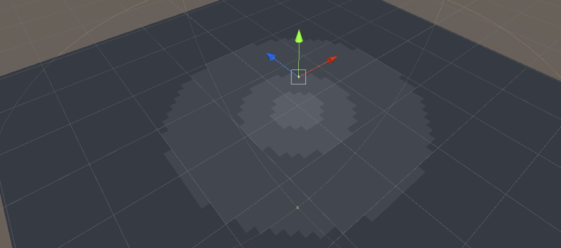

```
// Upgrade NOTE: replaced '_LightMatrix0' with 'unity_WorldToLight'
// Upgrade NOTE: replaced '_Object2World' with 'unity_ObjectToWorld'
// Upgrade NOTE: replaced 'mul(UNITY_MATRIX_MVP,*)' with 'UnityObjectToClipPos(*)'

Shader "Mine/SpotWithoutTexture" {
   Properties {
      _Diffuse ("Diffuse", Color) = (1, 1, 1, 1)
      _Specular ("Specular", Color) = (1, 1, 1, 1)
      _Gloss ("Gloss", Range(8.0, 256)) = 20
        _BumpMap ("发线纹理", 2D) = "bump" {}
       _Size ("图片大小", Float) = 20
       
       _PointLightSize ("点光源着色范围", Float) = 20
   }
   SubShader {
      Tags { "RenderType"="Opaque" }
      
      Pass {
         // Pass for ambient light & first pixel light (directional light)
         Tags { "LightMode"="ForwardBase" }
      
         CGPROGRAM
         
         // Apparently need to add this declaration 
         #pragma multi_compile_fwdbase  
         
         #pragma vertex vert
         #pragma fragment frag
         
         #include "Lighting.cginc"
         
         fixed4 _Diffuse;
         fixed4 _Specular;
         float _Gloss;
         
         struct a2v {
            float4 vertex : POSITION;
            float3 normal : NORMAL;
         };
         
         struct v2f {
            float4 pos : SV_POSITION;
            float3 worldNormal : TEXCOORD0;
            float3 worldPos : TEXCOORD1;
         };
         
         v2f vert(a2v v) {
            v2f o;
            o.pos = UnityObjectToClipPos(v.vertex);
            
            o.worldNormal = UnityObjectToWorldNormal(v.normal);
            
            o.worldPos = mul(unity_ObjectToWorld, v.vertex).xyz;
            
            return o;
         }
         
         fixed4 frag(v2f i) : SV_Target {
            fixed3 worldNormal = normalize(i.worldNormal);
            fixed3 worldLightDir = normalize(_WorldSpaceLightPos0.xyz);
            
            fixed3 ambient = UNITY_LIGHTMODEL_AMBIENT.xyz;
            
            fixed3 diffuse = _LightColor0.rgb * _Diffuse.rgb * max(0, dot(worldNormal, worldLightDir));

            fixed atten = 1.0;
            
//          return fixed4(ambient + diffuse * atten, 1.0);
             return fixed4(ambient, 1.0);
         }
         
         ENDCG
      }
   
      Pass {
         // Pass for other pixel lights
         Tags { "LightMode" = "ForwardAdd" }
         
         Blend One One
      
         CGPROGRAM
         
         // Apparently need to add this declaration
         #pragma multi_compile_fwdadd
         
         #pragma vertex vert
         #pragma fragment frag
         
         #include "Lighting.cginc"
         #include "AutoLight.cginc"
         
         fixed4 _Diffuse;
         fixed4 _Specular;
            
            sampler2D _BumpMap;
            float4 _BumpMap_ST;
            
         float _Gloss;
         float _Size;
         
         float _PointLightSize;
         
         struct a2v {
            float4 vertex : POSITION;
            float3 normal : NORMAL;
         };
         
         struct v2f {
            float4 pos : SV_POSITION;
            float3 worldNormal : TEXCOORD0;
            float3 worldPos : TEXCOORD1;
            
            float3 currPos : TEXCOORD2;
         };
         
         v2f vert(a2v v) {
            v2f o;
            o.pos = UnityObjectToClipPos(v.vertex);
            
            o.worldNormal = UnityObjectToWorldNormal(v.normal);
            
            float4 currPos = v.vertex;
            currPos.x = currPos.x - fmod(currPos.x, _Size) + _Size / 2;
            currPos.z = currPos.z - fmod(currPos.z, _Size) + _Size / 2;
            o.currPos = mul(unity_ObjectToWorld, currPos).xyz;
            
            o.worldPos = mul(unity_ObjectToWorld, v.vertex).xyz;
            
            return o;
         }
         
         fixed4 frag(v2f i) : SV_Target {
            fixed3 worldNormal = normalize(i.worldNormal);
            #ifdef USING_DIRECTIONAL_LIGHT
               fixed3 worldLightDir = normalize(_WorldSpaceLightPos0.xyz);
            #else
               fixed3 worldLightDir = normalize(_WorldSpaceLightPos0.xyz - i.worldPos.xyz);
            #endif
            
            fixed3 diffuse = _LightColor0.rgb * _Diffuse.rgb * max(0, dot(worldNormal, worldLightDir));
            
            diffuse = fixed3(1.0, 1.0, 1.0);
            
            // 测试修改worldpos
            i.worldPos.x = i.worldPos.x - fmod(i.worldPos.x, _Size) + _Size / 2;
            i.worldPos.z = i.worldPos.z - fmod(i.worldPos.z, _Size) + _Size / 2;
            
            #ifdef USING_DIRECTIONAL_LIGHT
               fixed atten = 1.0;
            #else
               #if defined (POINT)
//                  float3 lightCoord = mul(unity_WorldToLight, float4(i.worldPos, 1)).xyz;
//                  fixed atten = tex2D(_LightTexture0, dot(lightCoord, lightCoord).rr).UNITY_ATTEN_CHANNEL;
                    
                    float distance = length(_WorldSpaceLightPos0.xyz - i.worldPos.xyz);
                    fixed atten = 1 / distance;
                    
                    atten = floor(atten * _PointLightSize) / _PointLightSize;

                #elif defined (SPOT)
                    float4 lightCoord = mul(unity_WorldToLight, float4(i.worldPos, 1));
                    fixed atten = (lightCoord.z > 0) * tex2D(_LightTexture0, lightCoord.xy / lightCoord.w + 0.5).w * tex2D(_LightTextureB0, dot(lightCoord, lightCoord).rr).UNITY_ATTEN_CHANNEL;
                #else
                    fixed atten = 1.0;
                #endif
            #endif

            return fixed4(diffuse * atten, 1.0);
         }
         
         ENDCG
      }
   }
   FallBack "Specular"
}
```


移动的样式