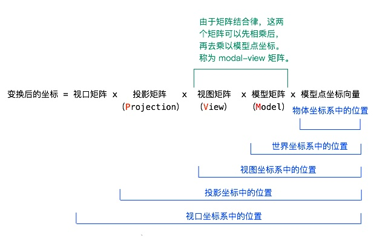

本节内容来自 [卡通渲染（上）：致从没看懂过着色器代码的你](https://zhuanlan.zhihu.com/p/25595069)
#### 关于如何进行光照计算
在明白了这点之后，我们就能够理解如何进行光照计算了。
1. 将光源位置（这是通过参数传入的）乘以模型视图矩阵（这是着色器提供给我们的），就能得到光源相对于摄像机的位置
2. 将这一位置归一化（就是计算单位向量），得到光源相对于摄像机的角度
3. 将其点乘单位法向量，得到亮度值（回想一下，两个向量点乘的意思是，获得一个向量在另一个向量上的投影，所以，这里得到的是光源在法向量方向的投影长度，它决定了一个点有多亮）

#### MVP矩阵

其中，中间的三项有个非常霸气的名字：MVP 矩阵！
为什么不是 PVM ？
因为从逻辑上来说，是先把模型点坐标向量乘以模型矩阵，然后乘以视图矩阵，然后乘以投影矩阵，然后乘以视口矩阵的。所以先后顺序的确是 MVP。
我们知道矩阵乘法是一个很耗时的操作，而由于模型矩阵和视图矩阵更可能是不变的，因而根据矩阵结合律，将它们先相乘得到模型视图矩阵（modal-view matrix），再与点坐标相乘。这样，以后几帧的计算，就可以不用分别乘以模型矩阵和视图矩阵，而是只乘以模型视图矩阵，达到减少矩阵乘法的次数的效果。
这一点稍作了解即可，如果看不懂，你只需要了解——
**一个物体的三维坐标向量，乘以模型视图矩阵后，能够得到它在试图坐标系中的位置，也就是它相对于摄像机的坐标位置。**