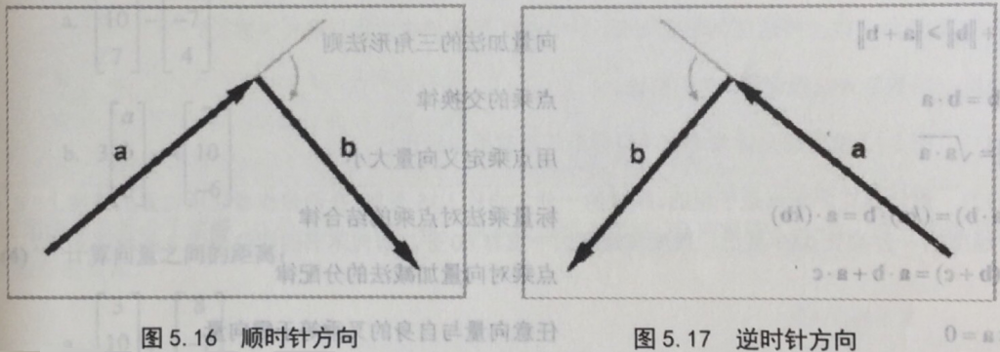

点乘

**设两组向量**

$latex a = (a\_{1}, a\_{2}, … a\_{n}) $  
$latex b = (b\_{1}, b\_{2}, … b\_{n}) $

**a和b的点乘公式为**

$latex a\\cdot b = a\_{1}b\_{1} + a\_{2}b\_{2} + … + a\_{n}b\_{n} $

**点乘几何意义** - 1. 点乘的几何意义可以用来表征或计算两个向量之间的家教，如果a和b为单位向量，那点乘的结果就是**两个向量夹角的正弦值**

$latex a\\cdot b = \\left | a \\right | \\left | b \\right | cos \\theta $

2\. 点乘的结果还可以看做是 第一个向量投影到第二个向量上（这里，向量的顺序是不重要的，点积运算是可交换的）

叉乘

**设两组向量**

$latex a = (x\_{1}, y\_{1}, z\_{1}) $  
$latex b = (x\_{2}, y\_{2}, z\_{2}) $

a和b的叉乘公式为

$latex a \\times b = \\begin{bmatrix}  
x\_{1}\\\\  
y\_{1}\\\\  
z\_{1}  
\\end{bmatrix}\\times \\begin{bmatrix}  
x\_{1}\\\\  
y\_{1}\\\\  
z\_{1}  
\\end{bmatrix} = \\begin{bmatrix}  
y\_{1}z\_{2} - z\_{1}y\_{2} \\\\  
z\_{1}x\_{2} - x\_{1}z\_{2} \\\\  
x\_{1}y\_{2} - y\_{1}x\_{2}  
\\end{bmatrix} $

**叉乘几何意义** - 叉乘得到的向量垂直于原来的两个向量。

$latex \\left | a \\times b \\right | = \\left | a \\right | \\left | b \\right | sin\\theta $

> **既然得到的是垂直两个向量的向量，那方向怎么算呢？**
> 
> 通过将a的头与b的尾相接，并检查从a到b是顺时针还是逆时针，能确定$latex a \\times b $ 的方向。  
> 在**左手坐标系**中，如果a和b呈顺时针，那么$latex a \\times b $ 指向您，如果a和b呈逆时针， $latex a \\times b $ 远离您。在**右手坐标系**中，恰好相反，如果a和b呈顺时针， $latex a \\times b $ 远离您，如果a和b呈逆时针， $latex a \\times b $ 指向您

