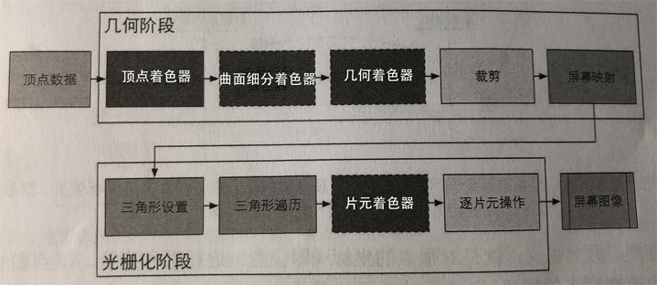

以下内容来自**《Unity Shader入门精要》**
作为shader编程的核心，需要重点复习一下。要理解这两个着色器，还要从GPU的渲染说起。
> 
***
### 概览
#### 1. 顶点着色器 Vertex
顶点着色器的输入来自CPU，本身不可以创建或者销毁任何顶点，而且**无法得到定点与顶点之间的关系**，例如我们无法知道两个顶点是否属于同一个三角网络。但正是因为这样的相互独立性，GPU可以利用本身的特性**并行化处理每一个顶点**，这意味着这一阶段的处理速度会很快。
顶点着色器主要完成的工作有：坐标变换和驻点光照

+ **坐标变换**
对顶点的坐标进行某种变换。顶点着色器可以在这一步中**修改顶点的位置**。相应的例子，我们可以通过改变顶点位置来模拟水面、布料等。还有一个重要的坐标变换的目标，就是**把顶点坐标从模型空间转换到齐次裁剪空间**。
类似 o.pos = mul(UNITY_MVP, v.position); 这样的代码，就是把顶点坐标从模型空间转到齐次裁剪空间，其中的UNITY_MVP使用的应该是MVP矩阵。
+ **逐顶点光照（书中未介绍）**

#### 2. 裁剪
#### 3. 屏幕映射
#### 4. 三角形设置
光栅阶段开始接收到的是 三角网格的顶点，即我们得到的是三角网格每条边的两个端点。通过“三角形设置”我们可以获得整个三角网格每条边上的像素坐标。它的输出是为了给下一个阶段做准备。
#### 5. 三角形遍历
根据几何阶段输出的定点信息，最终得到该三角网格覆盖的像素位置。对应像素会生成一个片元，而片元中的状态是对3个顶点的信息进行**插值**得到的。
这一步的输出就是得到一个片元序列，其内容包括但不限于它的**屏幕坐标、深度信息，以及其他从几何阶段输出的定点信息，例如法线、纹理坐标等**
#### 6. 片元着色器 Fragment
片元着色器（像素着色器）的输入时上一个阶段对定点信息插值得到的结果，更具体来说，时根据那些从**顶点着色器中输出的数据插值（三角形遍历）**得到的。
在这一个阶段中可以完成很多重要的渲染技术，其中最重要的技术之一是**纹理采样**。为了在片元着色器中进行纹理采样，我们通常会在顶点着色器阶段输出每个顶点对应的纹理坐标，然后经过光栅化阶段对三角网格的三个顶点对应的纹理坐标进行插值候，就可以得到其覆盖的片元的纹理坐标了
#### 7. 逐片元操作
当前阶段主要为对各种片元进行“测试”，书中介绍的是模板测试和深度测试，最后来一个混合。当前阶段是**高度可配置性**的，注意这个和可编程不同，是开发者设置测试阈值
***
### 案例
#### 1. 顶点着色器和片元着色器的通信
``` js
Shader "Unity Shaders Book/Chapter 5/Simple Shader" {
  SubShader {
    Pass {
      CGPROGRAM

      #pragma vertex vert
      #pragma fragment frag

      // 从把数据从应用阶段传递到顶点着色器
      struct a2v {
        flaot4 vertex : POSITION;
        float3 normal : NORMAL;
        flaot4 texcoord : TEXCOORD0;
      };

      // 使用一个结构体来定义顶点着色器的输出，并作为片元着色器的输入
      struct v2f {
        // SV_POSITION代表了顶点在裁剪空间中的位置信息
        float4 pos : SV_POSITION;
        // COLOR用于存储颜色信息
        fixed3 color : COLOR0;
      };

      v2f vert(a2v v) {
        v2f o;
        o.pos = mul(UNITY_MATRIX_MVP, v.vertex);
        // v.normal 包含了顶点的法线向量，范围在[-1, 1]之间
        // 下面代码把分量范围映射到了[0, 1.0]
        // 存储到o.color 传递给片元着色器
        o.color = v.normal * 0.5 + fixed3(0.5, 0.5, 0.5);
        return o
      }

      // 输入是把顶点着色器的输出进行插值后得到的结果
      fixed4 frag(v2f i) : SV_Target {
        // 将插值候的 i.color 显示到屏幕上
        return fixed4(i.color, 1.0);
      }

      ENDCG
    }
  }
}
```
